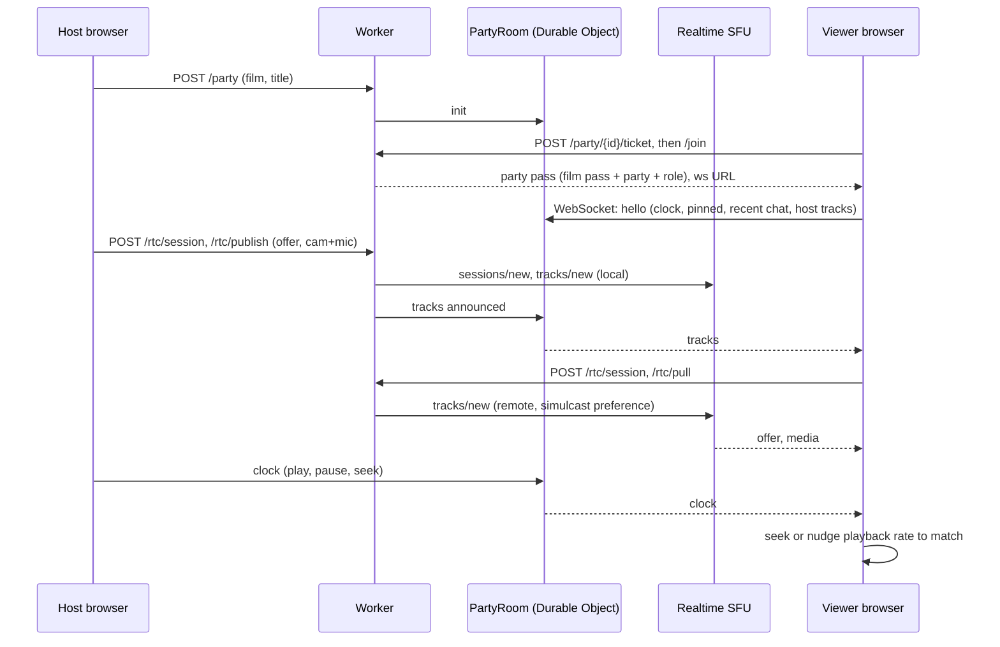

# Ztor watch party: architecture and pricing

Date: 2026-09-25. Scope: the watch party feature built 2026-09-24 to 2026-09-25 on the Ztor 5B platform (Cloudflare Free plan plus an Axinom DRM trial). Companion documents: `BUILD_REPORT.md` sections 8 to 12 (measurements and decisions in date order), `BUILD_PLAN.md` (progress log), the user guide (Claude doc "Ztor User Guide").

## 1. Summary

- **What it is.** One host plays a film; viewers watch the same film in sync, see and hear the host through a small camera tile, and chat. Viewers enter with a **ticket** that is valid for one party only; a film rental is a separate product and does not open a party.
- **What it runs on.** Cloudflare only: Workers, D1, Durable Objects, R2 and Realtime SFU. No LiveKit, no Cloudflare Stream, no RealtimeKit.
- **Cost.** $0 so far. A party of a hundred viewers costs nothing on top of the film. A thousand-viewer party costs about $20 to $60 a month of Realtime egress plus the $5 Workers Paid plan, against about $500 a month on LiveKit Cloud for the same audience.
- **Design choice that sets the cost.** The film never travels through WebRTC. Each viewer streams it from R2 with their own signed pass, and the host only broadcasts a clock. Only the host's camera and microphone go through the SFU, at 0.7 to 1.2 Mbps per viewer instead of the 5 to 8 Mbps the film would take.

## 2. Architecture

### 2.1 Components

| Component | Cloudflare service | What it holds or does | Code |
|---|---|---|---|
| API and pages | Worker `ztor-video` | routes for accounts, films, rentals, tickets, parties, WebRTC signalling; serves `/app` | `src/index.ts`, `src/app-routes.ts`, `src/party-routes.ts`, `src/auth.ts` |
| Party room | Durable Object `PartyRoom`, one per party (SQLite class) | roster, chat, pinned message, slow mode, mute and ban lists, the host's playback clock, the list of the host's live SFU tracks; WebSocket to every viewer with the Hibernation API | `src/party.ts` |
| Records | D1 `ztor-video` | users, sessions, films, rentals, parties, party_tickets, party_members, party_messages (chat archive), party_actions | `migrations/0005` to `0007` |
| Film delivery | R2 `ztor-streams` through the Worker | the film's protected-URL version: clear HLS and DASH segments, every link signed with the viewer's pass | existing Phase A media route |
| Host audio and video | Realtime SFU app (WebRTC) | the host publishes camera plus mic, or mic only; each viewer pulls the tracks; three simulcast layers | `src/sfu.ts`, `public/app.html` |
| Relay for strict NATs | Realtime TURN | wired, no key created yet (STUN only today) | `src/sfu.ts` |
| Page | `public/app.html` at `/app` | one file: sign in, Home, Watch, Party, Admin | |

### 2.2 How a party flows

Reading it: the Worker owns every credential, the room owns every piece of shared state, the SFU only forwards media, and the film itself goes straight from R2 to each viewer through the existing media route.

### 2.3 Rights: rental versus ticket

| Right | Grants | Checked by |
|---|---|---|
| Rental (48 h) | the film on the Watch page, DRM or protected-URL version, up to 4K | `/play` |
| Ticket | one party: the film inside that party, in sync, while it runs; capped at 1080p (protected-URL version) | `/party/{id}/join`; the pass it yields is bound to the party and the film; `/play` still refuses a ticket holder without a rental |
| Host | rents the film to screen it; needs no ticket | `/party` create and join |

The party pass is a JSON Web Token: the viewer's id, the film id, `mode: url`, the party id, the role and the display name, 4 hours. The media route accepts it for that film's protected-URL files only; the room accepts it for that party only.

### 2.4 Roles

| Role | Can do |
|---|---|
| user | rent, watch, get tickets, join parties, chat |
| host | everything a user can, plus create and run parties (camera, mic, pin, mute, remove, slow mode, end) |
| admin | everything a host can, plus the Admin screen (change roles; the last admin cannot demote themselves) |

Accounts: email and password, PBKDF2-SHA256 at 100,000 iterations, HttpOnly session cookie, 30 days, sessions in D1. The first account ever registered is the admin.

### 2.5 The pieces that took the most work

- **One SFU session per publish group.** Closing tracks by renegotiating a live PeerConnection fails in Chrome ("RTP extension ID reassignment not supported"): the SFU's answer renumbers header extensions on the now-inactive media line. So the host's camera plus mic is one session and the mic-only mode is another; stopping a group closes its connection, restarting opens a fresh one, and viewers open one connection per host session. Nothing is renegotiated on a live connection except the SFU's own first offer to a viewer.
- **Pull retries.** The room announces tracks as soon as the publish call returns; a viewer pulling within the next second gets `empty_track_error`. Viewers retry with backoff (0.8, 1.5, 2.2 s and so on).
- **Simulcast.** The host sends three layers of every video track (full, half and quarter size; 1.2, 0.4 and 0.15 Mbps for the camera). Viewers ask for the top layer with `priorityOrdering: asciibetical`, so the SFU steps them down when their bandwidth is short; a viewer loop steps down after more than 5 percent packet loss and back up after 30 clean seconds through `PUT /party/{id}/rtc/layer`. Down-switches show within 7 s, up-switches in 10 to 20 s.
- **Sync.** The clock is `{state, position, rate, at}` stamped with the room's time. Viewers keep an NTP-style offset from three round trips, seek when more than 2 s off and otherwise nudge playback rate by 5 percent. Measured drift while playing: within 0.2 s.
- **Host disconnect.** When no host socket is connected, the room retracts the host's tracks so viewers drop the dead sessions; the SFU collects them after 30 s of silence.
- **Chat archive.** Messages and host actions are written to D1 in one batch per 3-second tick, not per message.

### 2.6 Measured (headless Chrome 153 on a Mac, fake camera, real SFU)

| Item | Result |
|---|---|
| Host camera 1280x720 at 19 fps, egress per viewer | 0.7 Mbps measured, 1.2 Mbps cap |
| Camera tile at a viewer after publish | about 1 s |
| Film sync while playing | -0.06 to +0.17 s |
| Camera stop, restart, mic only, host page reload, late joiner | all pass |
| Security checks (join without ticket, viewer clock, viewer publish, ticket on another film, chat burst, kicked rejoin) | 6 of 6 pass |
| Realtime meter for all test parties | 0.06 GB egress, $0 |

## 3. Pricing

### 3.1 Price list of the services used

| Service | Free allowance | Beyond it | Notes |
|---|---|---|---|
| Workers | 100,000 requests per day | Workers Paid $5 per month, then $0.30 per million | Free plan stops serving at the cap; it never bills |
| Durable Objects | 100,000 requests per day, 13,000 GB-s per day, 5 GB | included in Workers Paid | incoming WebSocket messages count 20 to 1 |
| D1 | 5 M rows read and 100k rows written per day, 5 GB | included in Workers Paid | |
| R2 | 10 GB stored, 1 M class A and 10 M class B operations per month, egress free | $0.015 per GB stored | the only service that bills on the Free plan |
| Realtime SFU and TURN | 1,000 GB egress per month, shared | $0.05 per GB | no per-participant fee, no concurrency tier |
| RealtimeKit (not used) | free in beta, none after | $0.002 per participant-minute | rejected: bills every viewer per minute |
| Cloudflare Stream (not used) | none | $1 per 1,000 minutes delivered plus storage | only needed for recording or HLS output to people outside the room |

### 3.2 What a party costs

Host camera at the measured 0.7 Mbps is 0.32 GB per viewer-hour; at the 1.2 Mbps cap, 0.54 GB. The film's own delivery is R2 egress, which is free, plus about 1,200 Worker requests per hour watched.

| Scenario per month | Realtime egress | Realtime cost | Workers | Total on Cloudflare |
|---|---|---|---|---|
| One party, 100 viewers, 1 hour | 32 to 54 GB | $0 | Free plan | **$0** |
| Four parties, 100 viewers, 1 hour each | 130 to 220 GB | $0 | Free plan | **$0** |
| Four parties, 1,000 viewers, 1 hour each | 1.3 to 2.2 TB | $14 to $58 | Workers Paid, $5, because the film segments exceed 100,000 requests a day | **$19 to $63** |
| Each further 1,000 viewer-hours beyond the free terabyte | 0.32 to 0.54 TB | $16 to $27 | | |

Had the film been pushed through the SFU instead, a 1080p viewer would cost about 2.6 GB per hour: a thousand-viewer hour would be 2.6 TB, about $80. That is why the film goes from R2 and only the host's tracks go through WebRTC.

### 3.3 Against LiveKit Cloud

| | Cloudflare (this build) | LiveKit Cloud |
|---|---|---|
| Monthly fee | $0; $5 Workers Paid at scale | Build $0, Ship $50, Scale $500 |
| Per participant | none | 5,000 minutes on Build; 150,000 on Ship then $0.0005 per minute; 1.5 M on Scale then $0.0004 |
| Downstream bandwidth | 1,000 GB free, then $0.05 per GB | 50 GB on Build; 250 GB on Ship then $0.12 per GB; 3 TB on Scale then $0.10 |
| Concurrent connections | no published cap | 100 on Build, 1,000 on Ship, 5,000 on Scale |
| Room state, chat archive | Durable Object and D1, inside the free tier | not included; needs your own backend |
| Simulcast | supported; layer switching is your code (built) | automatic in the SDK |

| Scenario per month | Cloudflare | LiveKit |
|---|---|---|
| One party, 100 viewers, 1 hour | $0 | $50 (6,060 participant-minutes, over Build's 5,000) |
| Four parties, 100 viewers | $0 | $50 |
| Four parties, 1,000 viewers | $19 to $63 | $500 (host plus viewers exceed Ship's 1,000 connections) |
| Each further 1,000 viewer-hours | $16 to $27 | $56 to $95 |

RealtimeKit, Cloudflare's LiveKit-like SDK, would have been priced like LiveKit: $12 per 100-viewer hour and $120 per 1,000-viewer hour.

### 3.4 Account meters as of 2026-09-25

| Meter | Used this month | Free allowance |
|---|---|---|
| Workers requests | 18,110 | 100,000 per day |
| Durable Object requests | 1,630 | 100,000 per day |
| D1 rows read and written | 279k and 3.4k | 5 M and 100k per day |
| R2 storage | 8.20 GB (streams 4.36, masters 3.85) | 10 GB, the only meter near its cap |
| Realtime SFU egress | 0.06 GB | 1,000 GB per month |
| Billed | $0 | |

## 4. Limits and what changes at scale

| Audience | What changes | Cost |
|---|---|---|
| tens | nothing | $0 |
| hundreds | nothing on the party side; the film segments approach the Free plan's 100,000 requests a day at about 80 full film views a day | $0 until the cap, then Workers Paid $5 |
| thousands | Workers Paid for the film segments; a custom domain with a cache rule that ignores the pass token so segments come from cache; a TURN key so viewers behind strict NATs connect | $5 per month plus a domain; TURN shares the free terabyte |
| tens of thousands | HLS output to people outside the WebRTC room becomes cheaper than one WebRTC session each | Stream Live, $1 per 1,000 minutes |

## 5. Not built

| Item | Why | Cost to do |
|---|---|---|
| Ticket price and payment | no payment step in the product yet; the tickets table has price columns | a payment provider |
| Recording, replay, HLS output | would need Stream Live; not asked for | $1 per 1,000 minutes delivered |
| TURN key | not needed on the networks tested | $0, dashboard |
| Screen share | removed on request | |
| Password reset, email verification | needs an email sender | a mail API |
| Safari and iOS verification of the party page | only Chrome was driven headless; Safari FairPlay works on the Watch page | devices and time |

## 6. Sync fix (added 2026-10-01)

Reported from a real test: the host's and the viewer's picture were 1 to 2 s apart, and since the host pauses on a frame to ask questions about the scene, the frames must match.

**Why it happened.** The "sync" figure on the viewer page compared the viewer with the clock, not with the host's picture, and four things sat between the two: the room stamped the host's clock on arrival, so every viewer trailed by the host's uplink latency; the host reported on `play` (before its picture moved) and then only every 5 s; viewers checked every 0.5 s, ignored errors under 0.3 s, and corrected at 5 percent speed; and a paused viewer only jumped to the host's frame when more than 0.5 s off.

**What changed** (`public/app.html`, `src/party.ts`; nothing in the SFU, chat or tickets):

| | Before | After |
|---|---|---|
| Clock timestamp | room's arrival time | the host's own room-time stamp (same offset viewers use); the room accepts it within 3 s of its clock |
| Host reports | `play`, `pause`, `seeked`, every 5 s | also `playing` and `waiting` (a frozen host picture counts as paused), every 1 s while playing |
| Viewer check | every 0.5 s | on every clock message and every 0.25 s |
| Paused | seek only if > 0.5 s off | always seek to the host's frame (threshold one frame, once per clock) |
| Playing | dead band 0.3 s, 5 percent nudge, seek above 2 s | dead band one frame (0.04 s), proportional up to 10 percent (Chrome keeps the pitch), seek above 1 s with 2.5 s between seeks |
| Room-time offset | last of 3 pings at connect | lowest-latency of 3 pings, repeated every 30 s |
| Room storage | one write per clock | state changes, seeks and a 5 s heartbeat only, so the 1 s reports do not add D1-style row writes |

**Measured** (headless Chrome, host and viewer pages on one machine sampled at the same instant, 300 ms of emulated network latency on both, the 73 s SPL2 trailer; viewer minus host, in seconds):

| Phase | Before | After (new page, old room) |
|---|---|---|
| Playing, first 30 s, 2 s samples | -1.64 to -0.38, mean -0.83 after 10 s | -0.03 to -0.04 |
| Host pauses, 2 s and 4 s later | -0.11 (viewer stays on a different frame) | 0.00 |
| Host resumes | -0.27 | -0.06 |
| Host seeks while playing | +0.10 | -0.05 |
| Host seeks then pauses | 0.00 | 0.00 |

The "after" column was measured with the new page against the room code that was still deployed, which ignores the host's stamp, so the small remaining lag while playing is the uplink latency the deployed room removes. On the real network the host's phone adds its own camera and WebRTC delay to its voice, about 0.3 to 0.5 s, which is separate from the film clock and unchanged.

### 6.1 Voice alignment (added 2026-10-01, later the same day)

With the film frames matched, the next question was the host's voice: it travels through the SFU and arrives 0.3 s or more after the film clock, so "look at this" was heard after the frame appeared. Fix chosen by the user: each viewer delays its film by the measured voice delay, so the frame the host is talking about appears as the words arrive.

- **How the delay is measured** (`public/app.html`): half the host's WebRTC round trip to the SFU (the host sends it with every clock; `src/party.ts` stores it as `clock.rtt`), plus half the viewer's own round trip, plus the viewer's audio jitter buffer from the inbound audio statistics, plus 80 ms for encoding, decoding and the SFU. Measured every 2 s, smoothed 70/30, capped at 2 s, held at the last known round trip when a statistics sample has none, and 0 when no host audio is being received (camera and mic off).
- **How it is applied**: the viewer replays the host's timeline that much later. Each clock is held from its local arrival for the voice delay minus the time it already spent in transit, never longer than the voice delay, so a wrong time-offset estimate cannot hold a pause back. Paused clocks still land on the host's exact frame, just later, which is when the host's words about it arrive.
- **What a viewer sees**: the "clock" field shows `voice +0.xx s`, and the Details log prints the components every 10 s.

Measured (same harness, host camera and mic on, 300 ms emulated latency; the emulation also stretches the WebRTC round trips to about 625 ms each way, so the numbers are a worst case):

| Phase | Viewer minus host, film | Viewer's voice delay estimate |
|---|---|---|
| Playing (live, version c9909493) | -0.81 to -0.88 s | 0.90 s |
| Host pauses | +0.02 s, same frame | |
| Host resumes, seeks | -0.89 to -0.93 s | 0.90 s |
| Delay components in the log | host round trip 634 ms, viewer round trip 630 ms, jitter buffer 152 ms | 864 ms |
| Camera off, mic-only republished | delay drops to 0 then rebuilds from the new audio | 0 then 0.71 s |

The film lag equals the voice delay estimate, which is the design. On a real network the round trips are tens of milliseconds, so the delay should sit around 0.2 to 0.35 s, mostly the jitter buffer. What this test cannot check is the estimate against the true speaker-to-ear delay: that needs one real party with a phone, watching whether a pause and the host's words about it land together. Not built: shrinking the delay itself with a smaller receiver jitter buffer (the user's second option, held back for now).
